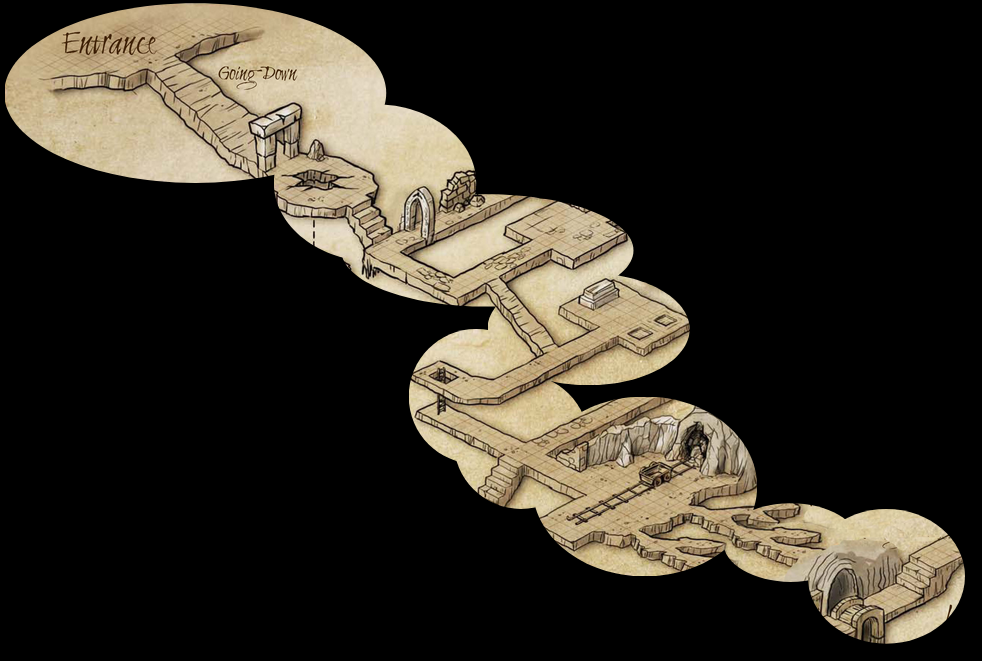

Online demo at: <https://chezsoi.org/lucas/jdr/shared-img-reveal/>

**Usage**: the [GM](https://en.wikipedia.org/wiki/Gamemaster) creates a table, and share the public URL with players.
The portions of the image seen by the other players can then be controlled the GM by clicking the hatched zones.

This web application was made as a companion for some scenarios for [Run. Die. Repeat.](https://labrysgames.itch.io/run-die-repeat) : [Les Couloirs du Temps @ itch.io](https://lucas-c.itch.io/les-couloirs-du-temps).

# Demo images
- [Hallways of Thime by Djekspek](https://www.deviantart.com/djekspek/art/Hallways-of-Thime-208976938) - [CC BY-NC-SA 3.0](https://creativecommons.org/licenses/by-nc-sa/3.0/)
- Rocks from [Isometric 64x64 Outside Tileset by Yar](https://opengameart.org/content/isometric-64x64-outside-tileset) - [CC BY 3.0](https://creativecommons.org/licenses/by/3.0/)
- [Map - Small Town](https://www.deviantart.com/ekizius/art/Map-Small-Town-795100291) & [Map - Village](https://www.deviantart.com/ekizius/art/Map-Village-795100444) by Ekizius - [CC BY-NC-SA 3.0](https://creativecommons.org/licenses/by-nc-sa/3.0/)
- [Fantasy portraits by TinySecretDoor](https://www.deviantart.com/tinysecretdoor/gallery/52921157/fantasy-portraits) - [CC BY-NC 3.0](https://creativecommons.org/licenses/by-nc/3.0/)
- [Hidden Gods of the Woods by Moira Games](https://moira-games.itch.io/hidden-gods-of-the-woods) ([They dug too deep](https://moira-games.itch.io/they-dug-too-deep) by the same author is also a great one-page dungeon)

Many more great CC BY-NC isometric maps can be found at [One Page Dungeon Contest](https://www.dungeoncontest.com/) or here: https://www.elventower.com/isometric-maps/

<!-- Other great illustrations:
* https://www.reddit.com/r/battlemaps/comments/lqf3yz/epic_isometric_crystal_dungeon/
* https://www.reddit.com/r/FantasyMaps/comments/l3g2os/secret_city_settlement_map/
* Rudok's Tavern | Main Hall isometric map : https://i.redd.it/0wbqhfakpfl61.jpg
* https://i.redd.it/ugtywg3wejs61.jpg -> explo post-apo ?
* https://www.reddit.com/r/inkarnate/comments/oosl2a/the_wizards_tower/
-->

# Installation

## Local launch

    pip install -r requirements.txt
    FLASK_ENV=development ./sir_app.py

## systemd service

    $ pew new shared-img-reveal -p python3 -r requirements.txt
    $ cat /etc/systemd/system/shared-img-reveal.service
    [Service]
    WorkingDirectory=/path/to/parent/dir
    ExecStart=/usr/local/bin/pew in shared-img-reveal python -u sir_app.py
    Restart=always

## nginx configuration

    location /shared-img-reveal {
        include uwsgi_params;
        rewrite ^/shared-img-reveal/?(.*)$ /$1 break;
        proxy_pass http://127.0.0.1:8086;
    }

## License
Thi code is released under [GPL v3 license](https://www.gnu.org/licenses/gpl-3.0.en.html),
[climate-strike BSD](https://github.com/climate-strike/license/blob/master/licenses/BSD)
and [The Hippocratic License 2.1](https://firstdonoharm.dev).
